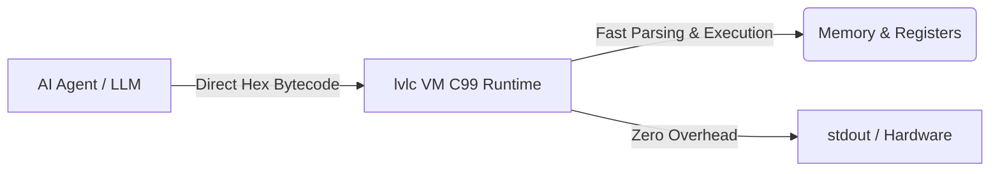

# LVLang (AI-Native 16-Bit Machine Bytecode Engine)

[](https://github.com/dotdok132/LVLang)
[](https://opensource.org/licenses/MIT)
[](https://en.wikipedia.org/wiki/C99)
[](https://github.com/dotdok132/LVLang)

**LVLang** is an AI-native 16-bit machine bytecode ISA and zero-overhead C99 runtime engine specifically engineered for direct LLM-to-Runtime execution, bypassing 100% of human text syntaxes, text compilers, and AST parsers.

---

## ⚡ Quick Start

```bash
# 1. Clone & Build
git clone https://github.com/dotdok132/LVLang
cd LVLang
gcc -O3 -Wall lvlc.c -o lvlc -lSDL2 -lm

# 2. Run Hello World ("Hi!" + Newline)
./lvlc "05x03 48x69 21x00 05x04 05xFF"
```

## 🏗️ Architecture



---

## 🌐 Official Ecosystem Repositories

- ⚡ **Core Engine & VM Runtime**: [dotdok132/LVLang](https://github.com/dotdok132/LVLang)
- 🖥️ **System OS Plugin**: [dotdok132/lvlang-system](https://github.com/dotdok132/lvlang-system) (`LibID 0x03` — Shell Commands, File I/O, Env Vars)
- ⌨️ **Keyboard Plugin**: [dotdok132/lvlang-keyboard](https://github.com/dotdok132/lvlang-keyboard) (`LibID 0x05` — Terminal Raw Input, Non-blocking Polling)
- 🎮 **SDL2 2D Engine Plugin**: [dotdok132/lvlang-sdl2](https://github.com/dotdok132/lvlang-sdl2) (`LibID 0x06` — 2D Windowing, Hardware Acceleration, Double Buffering)
- 🕒 **Time & Delays Plugin**: [dotdok132/lvlang-time](https://github.com/dotdok132/lvlang-time) (`LibID 0x07` — High-Precision Timestamps, Delays, Date Parsing)
- 🔤 **String & Text Plugin**: [dotdok132/lvlang-string](https://github.com/dotdok132/lvlang-string) (`LibID 0x08` — String Manipulation, Case Conversion, int<->string Parsing)
- 🔐 **Cryptography Plugin**: [dotdok132/lvlang-crypto](https://github.com/dotdok132/lvlang-crypto) (`LibID 0x02` — SHA256 & AES)
- 🐍 **Python SDK Binding**: [dotdok132/lvlang-python](https://github.com/dotdok132/lvlang-python) (Native Python SDK for AI agents & Py applications)
- 🟢 **JavaScript / Node.js SDK**: [dotdok132/lvlang-js](https://github.com/dotdok132/lvlang-js) (Node.js & Web JS SDK for web apps)
- ⚙️ **C / C++ / C# (.NET) SDK**: [dotdok132/lvlang-cpp-cs](https://github.com/dotdok132/lvlang-cpp-cs) (Header-only C++17, C, and C# .NET SDKs)

---

## ⚡ Key Philosophy: Strict 2-Byte ISA & Zero Human Bloat

Standard programming languages (C++, Python, JS) force LLMs to spend **over 90% of output tokens on human text formatting** (`function`, `return`, `#include`, braces, indentation).

**LVLang eliminates 100% of human text overhead:**

- **Strict 2-Byte ISA**: Every single instruction is **strictly 2 bytes** (`[GROUP]x[COMMAND]`).
- **1 LLM Token = 1 Executable Opcode**: Output format `01x64 01x08 02x03` maps 1:1 to single LLM tokens without subword tokenizer merging.
- **Direct 1:1 Instruction Count Relative Jumps**:
  - `09xN`: Jump **backward** $N$ instructions ($1..255$).
  - `0BxN`: Jump **forward** $N$ instructions ($1..255$).
  - `0DxN`: Jump **forward** $N$ instructions if stack top $== 0$.
  - `0FxN`: Jump **forward** $N$ instructions if stack top $\neq 0$.
- **Zero Parsing Overhead**: The C runtime directly executes the byte stream in memory without AST building or text tokenizers.

---

## 🚀 Performance Benchmarks

- **Execution Engine**: Pure C99 single-header runtime (`lvlang.h`).
- **Native JIT Engine**: Native x86-64 machine code emitter (`lvl_jit.h`).
- **Execution Speed**: **~177 Million Full Program Executions Per Second** (**5.62 ns** per program run).
- **JIT Compilation Time**: **295 nanoseconds** (0.000295 ms).

---

## 📊 Complete Opcode Matrix Specification

Every instruction occupies **strictly 2 bytes**: `[Group: 1 Byte] [Command/Operand: 1 Byte]`.

### 1. Stack, Registers & Memory (`Group 0x01`)
| Opcode | Operand | Name | Description |
|---|---|---|---|
| `0x01` | `0x00..0x7F` | `PUSH_IMM` | Push 7-bit integer $0..127$ onto data stack |
| `0x01` | `0x01` | `POP` | Pop top of data stack |
| `0x01` | `0x02` | `DUP` | Duplicate top element of stack |
| `0x01` | `0x03` | `SWAP` | Swap top two elements of stack |
| `0x01` | `0x04` | `PUSH_SHIFT_8` | Pop $a$, push $a \ll 8$ |
| `0x01` | `0x05` | `PUSH_SHIFT_16` | Pop $a$, push $a \ll 16$ |
| `0x01` | `0x10 + R` | `LOAD_REG` | Load register $R_0..R_{15}$ onto stack |
| `0x01` | `0x30 + R` | `STORE_REG` | Store stack top into register $R_0..R_{15}$ |
| `0x01` | `0x40 + R` | `LOAD_RAM` | Push `RAM[R_idx]` onto stack |
| `0x01` | `0x50 + R` | `STORE_RAM` | Pop stack top into `RAM[R_idx]` |
| `0x01` | `0x60` | `MALLOC` | Pop size, push chunk_id (Dynamic Heap Allocation) |
| `0x01` | `0x61` | `FREE` | Pop chunk_id (Dynamic Heap Free) |
| `0x01` | `0x62` | `LOAD_HEAP` | Pop offset, pop chunk_id, push `heap[chunk_id][offset]` |
| `0x01` | `0x63` | `STORE_HEAP` | Pop val, pop offset, pop chunk_id, `heap[chunk_id][offset] = val` |

### 2. Integer & Math (`Group 0x02`)
| Opcode | Operand | Name | Description |
|---|---|---|---|
| `0x02` | `0x01` | `ADD` | Pop $b, a$; push $a + b$ |
| `0x02` | `0x02` | `SUB` | Pop $b, a$; push $a - b$ |
| `0x02` | `0x03` | `MUL` | Pop $b, a$; push $a \times b$ |
| `0x02` | `0x04` | `DIV` | Pop $b, a$; push $a / b$ |
| `0x02` | `0x05` | `MOD` | Pop $b, a$; push $a \pmod b$ |
| `0x02` | `0x10 + R` | `INC_REG` | Increment register $R_i \leftarrow R_i + 1$ |
| `0x02` | `0x20 + R` | `DEC_REG` | Decrement register $R_i \leftarrow R_i - 1$ |

### 3. Comparison & Logic (`Group 0x03`)
| Opcode | Operand | Name | Description |
|---|---|---|---|
| `0x03` | `0x01` | `EQ` | Push $1$ if $a == b$ else $0$ |
| `0x03` | `0x02` | `NEQ` | Push $1$ if $a \neq b$ else $0$ |
| `0x03` | `0x03` | `GT` | Push $1$ if $a > b$ else $0$ |
| `0x03` | `0x04` | `LT` | Push $1$ if $a < b$ else $0$ |
| `0x03` | `0x05` | `GTE` | Push $1$ if $a \ge b$ else $0$ |
| `0x03` | `0x06` | `LTE` | Push $1$ if $a \le b$ else $0$ |
| `0x03` | `0x07` | `AND` | Push $1$ if $a \land b$ else $0$ |
| `0x03` | `0x08` | `OR` | Push $1$ if $a \lor b$ else $0$ |
| `0x03` | `0x09` | `NOT` | Push $1$ if $\neg a$ else $0$ |

### 4. Flow Control, Traps & Routine (`Group 0x04`)
| Opcode | Operand | Name | Description |
|---|---|---|---|
| `0x04` | `0x00` | `RET` | Return from subroutine |
| `0x04` | `0x01` | `YIELD` | Async coroutine pause |
| `0x04` | `0x05` | `SET_TRAP` | Set Exception Catch Handler |
| `0x04` | `0x06` | `CLEAR_TRAP` | Disable Exception Handler |
| `0x04` | `0x10..0x4F` | `JMP` | Jump absolute Target `(Op-0x10)*2` |
| `0x04` | `0x50..0x8F` | `JZ` | Jump absolute Target if 0 |
| `0x04` | `0x90..0xCF` | `JNZ` | Jump absolute Target if != 0 |
| `0x04` | `0xD0..0xFB` | `CALL` | Call subroutine |
| `0x04` | `0xFC` | `JZ_FAR` | Jump 16-bit Target if 0 |
| `0x04` | `0xFD` | `JNZ_FAR` | Jump 16-bit Target if != 0 |
| `0x04` | `0xFE` | `JMP_FAR` | Jump 16-bit Target |
| `0x04` | `0xFF` | `CALL_FAR` | Call 16-bit Target subroutine |

### 5. System & IO (`Group 0x05`)
| Opcode | Operand | Name | Description |
|---|---|---|---|
| `0x05` | `0x01` | `PRINT_NUM` | Print Integer |
| `0x05` | `0x02` | `PRINT_CHAR` | Print Char |
| `0x05` | `0x03` | `PRINT_STR` | Print Inline String |
| `0x05` | `0x04` | `PRINT_NL` | Print Newline |
| `0x05` | `0x05` | `SCAN_NUM` | Read Integer from Input |
| `0x05` | `0x06` | `SCAN_CHAR` | Read Char from Input |
| `0x05` | `0xFF` | `HALT` | Stop execution |

### 6. System Syscalls & Environment (`Group 0x06`)
| Opcode | Operand | Name | Description |
|---|---|---|---|
| `0x06` | `0x01` | `SYS_TIME` | Push Unix timestamp in seconds |
| `0x06` | `0x02` | `SYS_RAND` | Push pseudo-random 15-bit integer |
| `0x06` | `0x03` | `SYS_CLOCK` | Push process clock in milliseconds |

### 7. Float Math (`Group 0x0A`)
| Opcode | Operand | Name | Description |
|---|---|---|---|
| `0x0A` | `0x01` | `FADD` | Pop $b, a$ (floats); push $a + b$ |
| `0x0A` | `0x02` | `FSUB` | Pop $b, a$ (floats); push $a - b$ |
| `0x0A` | `0x03` | `FMUL` | Pop $b, a$ (floats); push $a \times b$ |
| `0x0A` | `0x04` | `FDIV` | Pop $b, a$ (floats); push $a / b$ |
| `0x0A` | `0x05` | `I2F` | Pop int $a$, push float $a$ |
| `0x0A` | `0x06` | `F2I` | Pop float $a$, push int $a$ |
| `0x0A` | `0x07` | `PRINT_FLOAT` | Pop float $a$, print float to stdout |
| `0x0A` | `0x08` | `FSQRT` | Pop float $a$; push $\sqrt{a}$ |
| `0x0A` | `0x09` | `FABS` | Pop float $a$; push $|a|$ |
| `0x0A` | `0x0A` | `FEQ` | Pop $b, a$ (floats); push 1 if $a == b$ else 0 |

### 8. Direct Relative Flow Control (`Group 0x09`, `0x0B`, `0x0C`, `0x0D`, `0x0F`)
| Opcode | Operand | Name | Description |
|---|---|---|---|
| `0x09` | `N` | `JMP_REL_BACK` | Jump **backward** $N$ instructions ($1..255$) |
| `0x0B` | `N` | `JMP_REL_FWD` | Jump **forward** $N$ instructions ($1..255$) |
| `0x0C` | `0x01` | `JZ_REL_BACK` | Pop $N$, pop $a$; jump **backward** $N$ instructions if $a == 0$ |
| `0x0C` | `0x02` | `JNZ_REL_BACK`| Pop $N$, pop $a$; jump **backward** $N$ instructions if $a \neq 0$ |
| `0x0C` | `0x03` | `JZ_REL_FWD`  | Pop $N$, pop $a$; jump **forward** $N$ instructions if $a == 0$ |
| `0x0C` | `0x04` | `JNZ_REL_FWD` | Pop $N$, pop $a$; jump **forward** $N$ instructions if $a \neq 0$ |
| `0x0D` | `N` | `JZ_REL_FWD` | Pop $a$; jump **forward** $N$ instructions if $a == 0$ |
| `0x0F` | `N` | `JNZ_REL_FWD` | Pop $a$; jump **forward** $N$ instructions if $a \neq 0$ |

### 9. Dynamic AI Macros (`Group 0x07`)
| Opcode | Operand | Name | Description |
|---|---|---|---|
| `0x07` | `0x70 + ID` | `DEF_MACRO` | Register dynamic subroutine `ID` ($0..15$) |
| `0x07` | `0x80 + ID` | `EXEC_MACRO` | Execute dynamic subroutine `ID` ($0..15$) in 1 instruction |
| `0x07` | `0x10 + R` | `MACRO_PRINT_REG` | Print register $R_i$ with newline |
| `0x07` | `0x30 + R` | `MACRO_PRINT_REG_RAW` | Print register $R_i$ without newline |
| `0x07` | `0x40 + R` | `MACRO_CLEAR_REG` | Zero out register $R_i \leftarrow 0$ |

### 10. Vector Math & Embeddings (`Group 0x08`)
| Opcode | Operand | Name | Description |
|---|---|---|---|
| `0x08` | `0x01` | `VEC_DOT_4D` | Dot product of `(R0..R3)` & `(R4..R7)` -> Push to stack |
| `0x08` | `0x02` | `VEC_ADD_4D` | `(R0..R3) += (R4..R7)` |
| `0x08` | `0x03` | `VEC_SCALE_4D` | `(R0..R3) *=` Stack Top |

### 11. Hardware Plugins & FFI (`Group 0x0E`)
| Opcode | Operand | Name | Description |
|---|---|---|---|
| `0x0E` | `0x01 [LibID] [FuncID]` | `FFI_CALL` | Call C FFI Plugin (0x06=SDL2, 0x07=Time, 0x08=String) |

---|---|---|---|
| `0x01` | `0x00..0x7F` | `PUSH_IMM` | Push 7-bit integer $0..127$ onto data stack |
| `0x01` | `0x01` | `POP` | Pop top of data stack |
| `0x01` | `0x02` | `DUP` | Duplicate top element of stack |
| `0x01` | `0x03` | `SWAP` | Swap top two elements of stack |
| `0x01` | `0x04` | `PUSH_SHIFT_8` | Pop $a$, push $a \ll 8$ |
| `0x01` | `0x05` | `PUSH_SHIFT_16` | Pop $a$, push $a \ll 16$ |
| `0x01` | `0x10 + R` | `LOAD_REG` | Load register $R_0..R_{15}$ onto stack |
| `0x01` | `0x30 + R` | `STORE_REG` | Store stack top into register $R_0..R_{15}$ |
| `0x01` | `0x40 + R` | `LOAD_RAM` | Push `RAM[R_idx]` onto stack |
| `0x01` | `0x50 + R` | `STORE_RAM` | Pop stack top into `RAM[R_idx]` |

### 2. Integer & Math (`Group 0x02`)
| Opcode | Operand | Name | Description |
|---|---|---|---|
| `0x02` | `0x01` | `ADD` | Pop $b, a$; push $a + b$ |
| `0x02` | `0x02` | `SUB` | Pop $b, a$; push $a - b$ |
| `0x02` | `0x03` | `MUL` | Pop $b, a$; push $a \times b$ |
| `0x02` | `0x04` | `DIV` | Pop $b, a$; push $a / b$ |
| `0x02` | `0x05` | `MOD` | Pop $b, a$; push $a \pmod b$ |
| `0x02` | `0x10 + R` | `INC_REG` | Increment register $R_i \leftarrow R_i + 1$ |
| `0x02` | `0x20 + R` | `DEC_REG` | Decrement register $R_i \leftarrow R_i - 1$ |

### 3. Comparison & Logic (`Group 0x03`)
| Opcode | Operand | Name | Description |
|---|---|---|---|
| `0x03` | `0x01` | `EQ` | Push $1$ if $a == b$ else $0$ |
| `0x03` | `0x02` | `NEQ` | Push $1$ if $a \neq b$ else $0$ |
| `0x03` | `0x03` | `GT` | Push $1$ if $a > b$ else $0$ |
| `0x03` | `0x04` | `LT` | Push $1$ if $a < b$ else $0$ |

### 4. Direct Relative Flow Control (`Group 0x09`, `0x0B`, `0x0D`, `0x0F`)
| Opcode | Operand | Name | Description |
|---|---|---|---|
| `0x09` | `N` | `JMP_REL_BACK` | Jump **backward** $N$ instructions ($1..255$) |
| `0x0B` | `N` | `JMP_REL_FWD` | Jump **forward** $N$ instructions ($1..255$) |
| `0x0D` | `N` | `JZ_REL_FWD` | Pop $a$; jump **forward** $N$ instructions if $a == 0$ |
| `0x0F` | `N` | `JNZ_REL_FWD` | Pop $a$; jump **forward** $N$ instructions if $a \neq 0$ |

### 5. Dynamic AI Macros (`Group 0x07`)
| Opcode | Operand | Name | Description |
|---|---|---|---|
| `0x07` | `0x70 + ID` | `DEF_MACRO` | Register dynamic subroutine `ID` ($0..15$) |
| `0x07` | `0x80 + ID` | `EXEC_MACRO` | Execute dynamic subroutine `ID` ($0..15$) in 1 instruction |
| `0x07` | `0x40 + R` | `CLEAR_REG` | Zero out register $R_i \leftarrow 0$ |

### 6. Hardware Plugins & FFI (`Group 0x0E`)
| Opcode | Operand | Name | Description |
|---|---|---|---|
| `0x0E` | `0x01 [LibID] [FuncID]` | `FFI_CALL` | Call C FFI Plugin (0x06=SDL2, 0x07=Time, 0x08=String) |

---

## 🛠️ Building & Running CLI (`lvlc`)

```bash
# Build runtime CLI
gcc -O3 -Wall lvlc.c -o lvlc -lSDL2

# Validate hex bytecode stream
./lvlc --validate "01x64 01x08 02x03 0Ex01 06x01 05xFF"

# Disassemble hex stream to human opcode trace
./lvlc --disasm "01x64 01x08 02x03 0Ex01 06x01 05xFF"

# Run Interactive Calculator (15 * 6 = 90)
printf "15\n3\n6\n" | ./lvlc "05x03 43x61 6Cx6C 75x6C 61x74 6Fx72 0Ax4E 75x6D 31x3A 20x00 05x05 01x30 05x03 4Fx70 20x28 31x3D 2Bx2C 20x32 3Dx2D 2Cx20 33x3D 2Ax2C 20x34 3Dx2F 29x3A 20x00 05x05 01x31 05x03 4Ex75 6Dx32 3Ax20 20x00 05x05 01x32 01x11 01x81 03x01 0Dx05 01x10 01x12 02x01 01x33 0Bx16 01x11 01x82 03x01 0Dx05 01x10 01x12 02x02 01x33 0Bx10 01x11 01x83 03x01 0Dx05 01x10 01x12 02x03 01x33 0Bx0A 01x10 01x12 02x04 01x33 05x03 52x65 73x75 6Cx74 3Ax20 20x00 01x13 05x01 05x04 05xFF"
```

---

## 📄 License

MIT License. Engineered for AI Agent Architectures, LLM Bytecode Synthesis, and High-Speed Hardware Execution.
